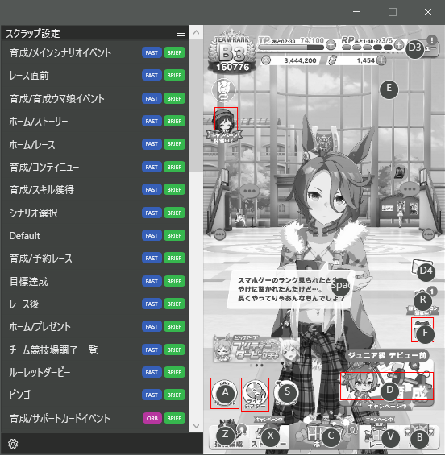

# UmamusumeKeyCtl

UmamusumeKeyCtlは、DMM版ウマ娘をキーボードから操作できるようにするアプリケーションです。

## 使い方

右側にキャプチャ結果とホットキー、左側に設定一覧が表示されます。  
表示されているホットキーを押すと、ウマ娘上での対応する場所が押されるようになっています。  
なお、DMM版ウマ娘がバックグラウンド状態の場合は動作を停止するようになっています。

詳しくは [wiki/使い方](https://github.com/Sakusakumura/UmamusumeKeyCtl/wiki/%E4%BD%BF%E3%81%84%E6%96%B9)
を参照してください。

## 最新版

[v1.0.0](https://github.com/Sakusakumura/UmamusumeKeyCtl/releases/tag/1.0.0)

## インストール

[Releasesページ](https://github.com/Sakusakumura/UmamusumeKeyCtl/releases) 
からumamusumeKeyCtl_[任意のバージョン].zipをダウンロードして解凍し、解凍されたフォルダを好きな場所に移動してください。  
フォルダ内のumamusumeKeyCtl.exeを実行すると起動します。

## アンインストール

umamusumeKeyCtl.exeが含まれているフォルダを削除することでアンインストールが完了します。

## 免責事項

作者は、本アプリケーションによって生じた如何なる損害について、責任を負わないこととします。  
使用にあたっては、自己責任でお願いします。  
また、本アプリケーションはウマ娘がどのシーンに最も近いかを計算により判断しますが、その精度について100%の保証をするものではありません。

何かあればgithubのissuesにお願いします。

## ライセンス

LICENSEを参照してください。